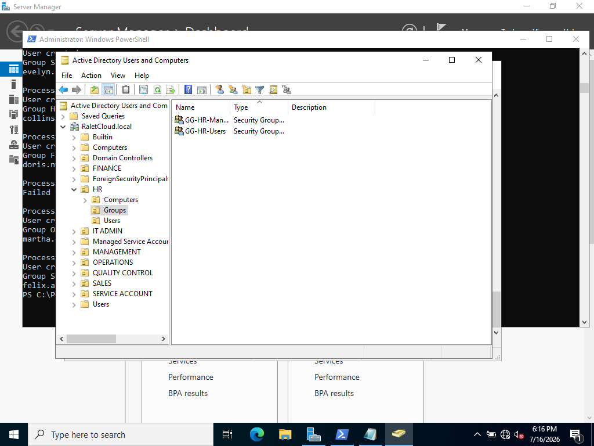
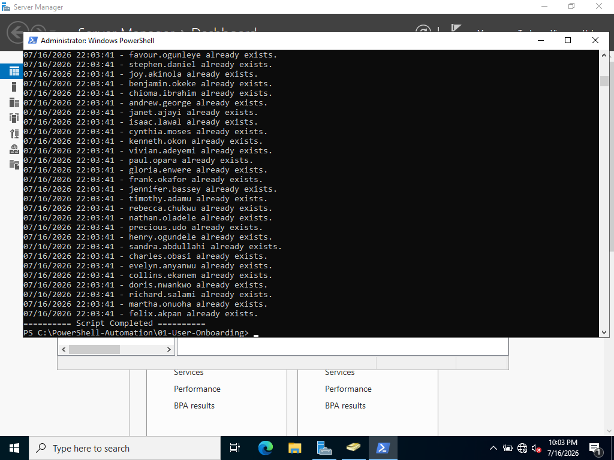
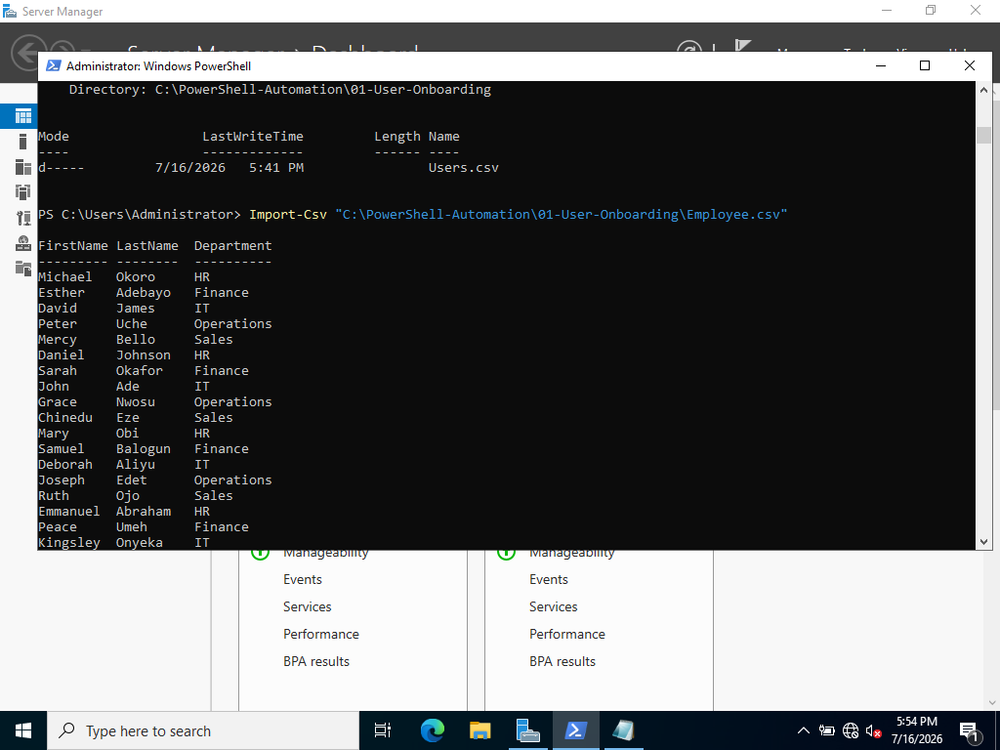

# powershell-user-onboarding-lab
## Bulk Active Directory User Provisioning with PowerShell and CSV


## Overview

This project demonstrates how to automate Active Directory user onboarding using PowerShell and CSV files.

Instead of manually creating user accounts one at a time, the script provisions multiple users automatically, places them into the correct Organizational Units (OUs), assigns security group memberships, and logs all actions for auditing and troubleshooting.

This project simulates a real-world enterprise onboarding process in which HR provides employee information and IT automates account provisioning.

---

## Business Problem

In enterprise environments, onboarding dozens or hundreds of users manually can lead to:

- Inconsistent account configuration
- Incorrect group assignments
- Increased administrative effort
- Human error
- Lack of auditing and traceability

This project solves these challenges through automation.

---

## Features

 Bulk user creation from CSV

 Automatic Organizational Unit placement

 Department-based security group assignment

 User existence checks

 Logging and error handling

 Force password change at first logon

 Standardized naming convention

 Scalable onboarding workflow

---

## Technologies Used

- Windows Server 2022
- Active Directory Domain Services (AD DS)
- PowerShell
- CSV Data Import
- Git & GitHub

---

## Lab Environment

### Domain

```text
raletcloud.local
```

### Domain Controller

```text
DC-01
```

### Client Machine

```text
CLIENT-01
```

---

## Active Directory Structure

```text
RaletCloud.local
│
├── HR
│   ├── Users
│   └── Groups
│
├── FINANCE
│   ├── Users
│   └── Groups
│
├── SALES
│   ├── Users
│   └── Groups
│
├── OPERATIONS
│   ├── Users
│   └── Groups
│
├── MANAGEMENT
│   ├── Users
│   └── Groups
│
└── IT ADMIN
    ├── Users
    └── Groups
```

---

## Project Structure

```text
01-User-Onboarding
│
├── New-UserProvisioning.ps1
├── Employee-Sample.csv
├── README.md
├── Screenshots
│   ├── 01-AD-Structure.png
│   ├── 02-Script-Execution.png
│   ├── 03-Users-Created.png
│   ├── 04-Group-Membership.png
│   └── 05-Log-File.png
└── Logs
```

---

## Sample CSV File

```csv
FirstName, LastName, Department
John, Smith, HR
Grace, Johnson, Finance
David, James, IT
Peter,Okafor,Sales
Mary, Ade, Operations
```

---

## Workflow

```text
HR provides employee list
            ↓
PowerShell imports CSV
            ↓
Create Active Directory accounts
            ↓
Assign users to OUs
            ↓
Assign Security Groups
            ↓
Write logs
            ↓
Force password change at first logon
```

---

## Example Script Execution

```powershell
.\New-UserProvisioning.ps1
```

Example output:

```text
Processing John Smith...
User created.
Added to GG-HR-Users.
john. Smith created successfully.
```

---

## Screenshots

### Active Directory Structure



### Script Execution


### Users Created


### Group Membership


### Log File



### CSV File


---

## Skills Demonstrated

- Active Directory Administration
- Identity and Access Management (IAM)
- PowerShell Automation
- Windows Server Administration
- User Lifecycle Management
- Security Group Management
- Documentation and Logging
- Enterprise Onboarding Processes
- Git and GitHub

---

## Future Improvements

- Automatic password generation
- Email notifications
- User deprovisioning scripts
- Account expiration handling
- Manager assignment
- Home folder creation
- Microsoft Entra ID integration
- Hybrid identity synchronization

---

## Author

**Michael Okwuora**

Infrastructure & Identity Engineer

- Windows Server
- Active Directory
- Microsoft 365
- Entra ID
- PowerShell Automation
- Cloud Security

LinkedIn: www.linkedin.com/in/michaelokwuora001


